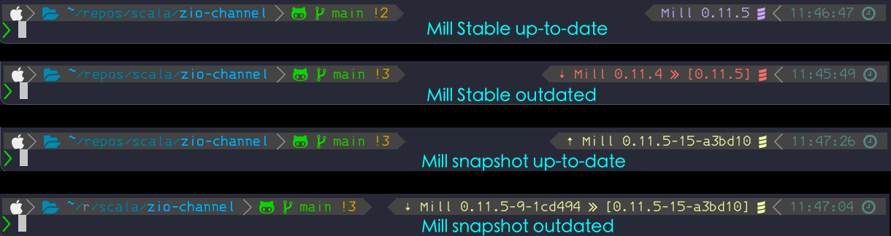

# Scala Mill Build Tool Completion script for ZSH

This plugin adds Scala [Mill build tool](http://mill-build.com/mill/Intro_to_Mill.html) completion capabilities to zsh shell.

It can be used as `./mill <tab>` that lists all modules, root level tasks and flags or
`./mill mymodule.<tab>` showing tasks for specific module. It works with deeper tasks as well like `./mill mymodule.test <tab>`.

The dots between modules and tasks are smartly added. The mill build data is cached for faster execution after the initial run. The cache is invalidated if `build.sc` is changed.

It also adds to [P10K](https://github.com/romkatv/powerlevel10k) Zsh theme the current Mill version for the project dir and if there are updates to Mill.



There is also a convenience function `millupd` to allow updating the current project Mill version. It updates `.mill-version` with latest stable version or if called with `-s` argument it updates to latest snapshot version.

## Installation

### For Oh-My-Zsh

```sh
cd "$HOME/.oh-my-zsh/custom/plugins" && git clone https://github.com/carlosedp/mill-zsh-completions.git
```

Add mill-zsh-completions to plugins array in ~/.zshrc

```txt
plugins=(
    aliases
    autojump
    mill-zsh-completions
    ...

```

### For Zinit

    ~/.zshrc

source "$HOME/.zinit/bin/zinit.zsh"
zinit ice lucid nocompile
zinit load carlosedp/mill-zsh-completions

### Installing without a framework

```sh
git clone https://github.com/carlosedp/mill-zsh-completions.git
```

And source mill-zsh-completions.plugin.zsh or add code to zshrc or any startup script

To use the P10K prompt element, add `mill_version` to the `p10k.zsh` file as in:

```shell
  #       typeset -g POWERLEVEL9K_RIGHT_PROMPT_ELEMENTS=(
  #       status # already exists
  #       ...
  #       mill_version
  #       ...
```
